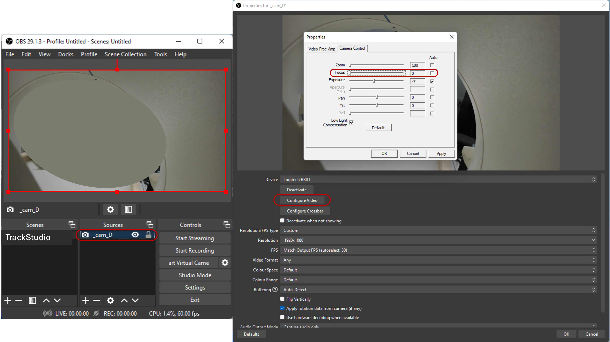
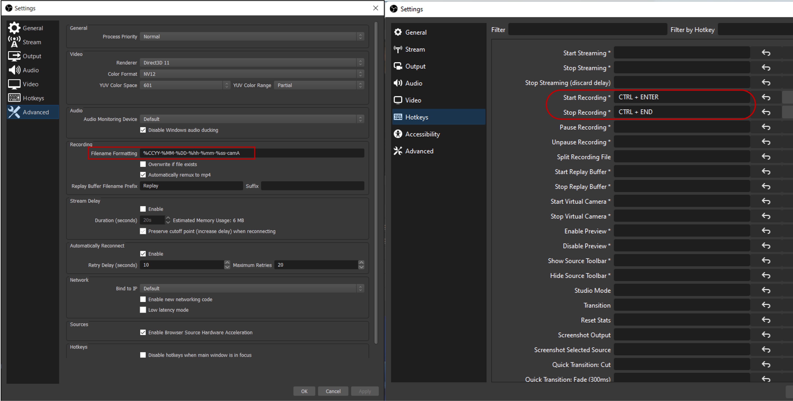
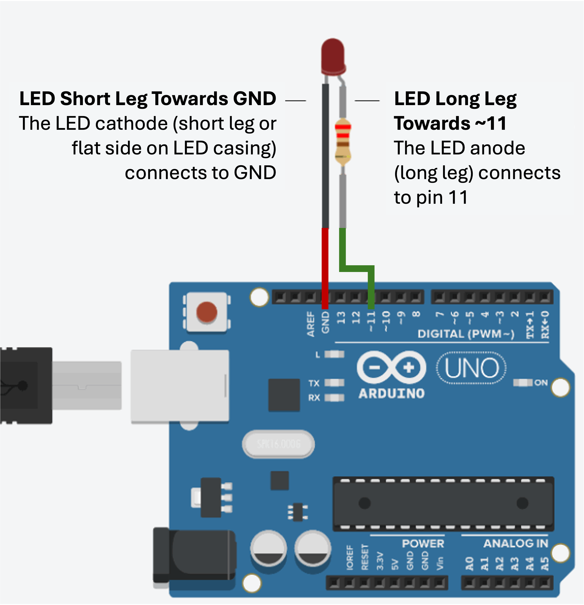

# TrackStudio
TrackStudio is an interactive open-source toolkit for markerless tracking. It provides a visual interface enabling trimming of videos, synchronising between cameras, using MediaPipe and Anipose for 2D and 3D tracking (including camera calibration) with result visualisation, without the requirement of any coding. It is aimed at any user regardless of their technical level of expertise. Advanced users can still enhance the utility of the toolkit and easily replace the methods used for 2D and 3D markerless tracking (see "Code Architecture" section below).

Check out the [TrackStudio paper](https://www.biorxiv.org) for detailed information on how to install and use TrackStudio and general advice on markerless tracking video recordings and setup.

Below is included further information on multi-camera recording setups in OBS, light-based approach for cameras synchronisation, and details on code implementation.

## Multi-camera recording setup via OBS software

### Video Recording – OBS
- Launch “n” instances of OBS studio, where “n” is the number of cameras you have.
  
_N.B. On each new OBS instance you will be prompted with a warning: click on Launch anyway._
- Place the OBS instances so that each window is fully visible (non-overlapping, with nothing obstructing the windows), ideally on a separate monitor.
- Starting from the top window, configure each OBS instance for their respective camera. Below is an example of 4 “Logitech Brio” cameras, with name extensions for each being camA, camB, camC, and camD respectively. For each OBS instance (see Figure 1 below):
- Double-click on “_camD” (under Sources), which is what 1 of the Brio cameras is named as.
- From the Device dropdown menu find the camera (Logitech Brio).

_N.B. The 3 cameras have the same ‘computer name’, select them one after the other until you get to the relevant camera._
- Double-click on Configure video, move to the Camera control tab, untick the Focus auto tickbox and set the slider to zero. Click on Apply and close.
- Click Ok on the Properties for ‘_camD’ OBS instance.

  

**Figure 1** _Example of camera settings adjustments as per the above text._
 
- Double-click on Settings (under Controls), move to the Advanced tab and change the Filename formatting to %CCYY-%MM-%DD %hh-%mm-%ss_camX (where X is the letter – A, B or C – corresponding to the camera you are setting). Click on Apply and close (see Figure 2 below).
- In settings -> Hotkeys: ‘Start recording’ should be CTRL + ENTER and ‘Stop recording’ should be CTRL + END (see Figure 2 below).
- Make sure you followed this procedure for all the cameras.

  

**Figure 2** _Example of OBS camera naming and hotkeys settings as per the above text._

### Camera positioning
- Orient the cameras so that the workspace, the objects and the hand are visible by all the cameras at all times (or at least by 2 cameras).
- Every time the camera positions change a new calibration recording needs to be done.
- Make sure the cameras stands are well fixed, cameras must not move during a recording.
- Perform the calibration as described in the [TrackStudio paper appendix](https://www.biorxiv.org).
  
_N.B. Always perform a calibration before starting recording with a given cameras configuration._

## Light-based camera synchronisation

One of the simplest and most effective ways to synchronise different cameras (ensure frame 1 on Camera 1 is the same as frame 1 on Camera 2) is via light or sound. Here, it’s covered how to set up LED lights for synchronisation and test the recordings and synchronisation.

Things you need: (1) Arduino (mini, Uno, mega – it does not matter), (2) LED light(s), (3) Wires and resistor (200-250 Ohms)

First, connect the LED light(s) to the Arduino, using the wires and resistor as such:

  

Second, connect the Arduino to a computer via the provided USB cable.

Third, test your recordings and synchronisation by running a script that turns on a light(s) for 5s, then turns it off for 5s, which is repeated 5 times. Example script for this in MATLAB and Python are provided in /examples (LED_test_MATLAB.m and LED_test_Python.py).

This ensures that you know the time difference between Light-ON and Light-OFF should be 5 seconds, and you know the number of frames that should be contained within these 5 seconds for each camera – if a camera records at 60 frames-per-second, number of frames will be 300 (60*5).

The test is necessary not only to ensure that the light detection is set up correctly (correct ROI and LED intensity were chosen), but also that you are not losing video data. Video data can be lost due to multiple reasons, such as insufficient hardware (computer is not powerful enough), programmes that run in the background and make the recordings lag (due to interruptions), or incorrect camera setup (check USB ports and OBS).

## Code Architecture

The main Python script, Python_TS_GUI.py, contains the graphical user interface (GUI) and operates/calls all the main functions for the toolkit. It contains the settings for the GUI and visualisation as well as setting variables for executing markerless tracking operations (e.g. video directory, file extensions, body part that is selected for tracking, calibration settings, etc.). All the GUI pages are defined in their respective functions noted with “_page” in their function name; the processing windows within each page are defined in their respective functions noted with “_window” in their function name.

Whenever processing is required, it is submitted via starting a thread, so that visualisation and updates are provided in parallel with the processing. Starting a new thread is handled by the “start_threads” function, which detects the processing that is submitted (e.g. calibration) and starts a unique thread for it. Checking and closing threads are provided by “check_thread_status” and “close_threads” functions respectively. 

Communications between the processing thread and the main thread for the GUI are handled via the “processing_communication” function, which can be passed to functions outside of the main Python_TS_GUI.py script via “safe_gui_callback” function.

Video Trimming is done either manually or automatically (via LED detection). All the functions pertaining to video trimming are contained within videoTrim_functions and are called from the Python_TS_GUI.py script when the respective buttons are pressed. 

The rest of the GUI functionality is mainly handled by functions within the “annotationFolders.py” script, called from the Python_TS_GUI.py script. For 2D annotation, it automatically navigates to the relevant directory and executes a MediaPipe-based script via a MediaPipe-specific virtual environment. Similarly, for calibration, triangulation, and video labelling, it automatically navigates to the relevant directory and executes relevant Anipose commands via the main environment, which contains not only the GUI functionality but also Anipose-preconfigured packages.

If people want to call the GUI via an Anaconda Command Prompt window, they can do so by navigating to the GUI’s folder, activating the GUI and Anipose environment (“conda activate aniposeEnv”), followed by running the main Python_TS_GUI.py script (“python Python_TS_GUI.py”).

If people want to change the methods for 2D/3D tracking or calibration, they can do so by pre-packaging an environment and changing the relevant lines in the “annotationFolders.py” script for that tracking functionality. For example, if someone wants to change how 2D annotations are done, they only need to change 2 lines within the “annotationFolders.py” script:

Line 28: execute_anaconda_command(f"conda run -n mediaPipeEnv python {run2D_dir} \"{path}\" \"{dest_folder}\" \"{selected_bodypart}\"",report_callback)

Line 56: execute_anaconda_command(f"conda run -n mediaPipeEnv python {run2D_dir} \"{path}\" \"{folder_path}\" \"{selected_bodypart}\"",report_callback)

Both lines are the same, and would need to be updated in the same manner:
1)	Substitute the “run2D.py” script within the GUI folder with the method that you want to use – the script name should remain “run2D.py”. Currently “run2D.py” script is having 3 inputs for (1) the video directory that you want to annotate, (2) the output directory, and (3) the selected body part for annotation (“video_dir, output_dir, bodypart_selection”) – if your function uses more inputs, this part of the line should also be changed.
2)	Change the “mediaPipeEnv” to the name of the virtual environment for the tool that you are using for your method (e.g. OpenPose).

## License
TrackStudio is released under the Apache-2.0 license.  
See `LICENSE` and `NOTICE` for details and third-party attributions.
